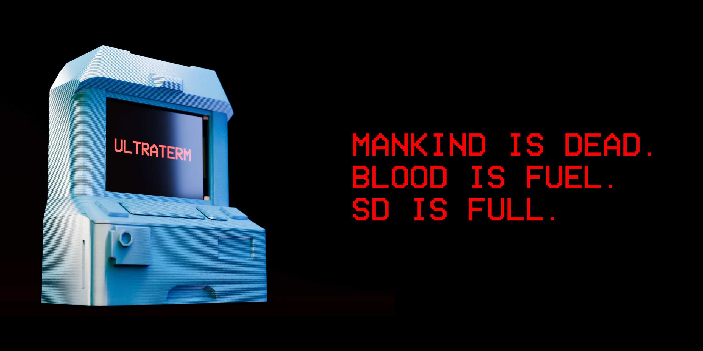

# ULTRATERM

- A 2000mAh battery
- Bluetooth headphone support
- USB-C storage interface
- Removable SD card storage ( and a custom microSD card adapter )
The case is designed to be entirely 3D printable, and assembled without adhesive or fasteners.
While the terminal isn't a perfect replica, it's decently close. ( for example, there's none of the wires near the top, but there is a magnetic attachment point so I *can* add them )

This project was made as mostly a fun intro to custom hardware. I've made keyboards before, but design wise those are fairly simplec ( this isn't much more complicated ). I decided to shape it after the ULTRAKILL Cybergrind terminal because that's the one that handles  cybergrind music ingame, so I thought that would be a cool part to try and recreate. Even though it isn't *the* classic terminal, its form factor is also a *lot* more forgiving to fit a screen and PCB and stuff into when compared to the shop terminals, which also don't have as many good options for physical interface. 

If you happen to make your own, I'd suggest either 3d-printing it in blue for minimum effort, or printing it in grey, painting it, then scuffing the paint to give it the worn look it has in-game. 

## Gallery

*more in [./gallery](gallery)*

## PCB

## Case

## BOM 
*prices in usd*
| Item | Quantity | Price | Supplier | Notes |
| --------------- | --------------- | --------------- | --------------- | --------------- |
| PCB | 5 | 4.7 | JLCPCB | |
| TINYPICO v2 | 1 | 39.5| Digikey | 29.41 + 10.00 shipping ( better than other places charging 20+ 25)|
|TZT 240x320 2.8" SPI ST7789V LCD Touch Panel | 1 | 7.09 | Aliexpress | |
| 3.7v 2000mah LiPo battery | 1 | 16.92 | Amazon | price comparable to ali, with substantially faster shipping options |
| Pin Headers | 20 | 2.00 | Aliexpress | for stupid LCD mounting soln. |
| 22Awg wire | 5m | 2.4 | Aliexpress | front panel mount + battery backup soln. |
| 32gb microSD card |1 | 4.7 | LCSC | | 
| 32gb SD card|1 | 5.8 | LCSC | |
| LM809 | 1 | 0.66 | LCSC | | 
| JST-PH-2 | 10 | 0.59 | LCSC | |
| SPDT slide switch | 20 | 0.48  | LCSC | |
| 6mm pushbutton | 50 | 0.84 | LCSC | |
| Amphenol 10067847-001RLF | 1 | 1.31 | LCSC | |
| Hirose C719027 | 1| 1.04 | LCSC |
| LCSC Shipping || 12.88  | LCSC | | 
| Total | 1 |  95.21| | |  
## Assembly

*we'll see how this goes once I get the parts in*

## LICENSE

This project uses the [CC-BY-SA-4.0](https://creativecommons.org/licenses/by-sa/4.0/) for all firmware, documentation, renders, and other writing. Hardware including all Case and PCB designs, is licensed under the [CERN-OHL-W v2](https://ohwr.org/cern_ohl_w_v2.txt)
> This project was heavily inspired by the game ULTRAKILL, created by Hakita (Arsi "Hakita" Patala). The ULTRATERM design, as well as some assets used in renders are derived from or inspired by ULTRAKILL.
All rights to ULTRAKILL belong to Hakita and New Blood Interactive. This project is not affiliated with or endorsed by Hakita or New Blood. 
( [ULTRAKILL is a banger game, you should totally get it, it's like 20 bucks ](http://devilmayquake.com))

This project was made for [*highway*](https://highway.hackclub.com)
